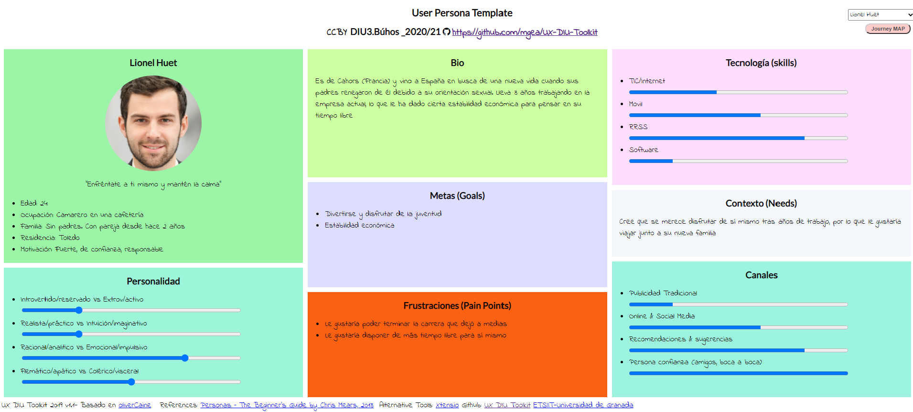

# Proceso de Diseño 

## Paso 1. UX Desk Research & Analisis 

1.a Competitive Analysis
-----

[Freetour](https://www.freetour.com): plataforma gratuita destinada a planificar rutas de viaje que no suponen coste alguno. La mayoría de estas están basadas en guías con propina. También existen rutas de pago, que le dan un mayor repertorio.

[way away](https://www.way-away.es/): plataforma gratuita destinada a ofrecer una planificación de rutas completa para viajes de entre 3 y 7 días en una ciudad elegida. Cuenta con una versión de pago para mejorar la experiencia con mapas offline y rutas detalladas.

[World Travel Guide](https://www.worldtravelguide.net/): plataforma gratuita destinada a ofrecer una planificación de rutas para viajes, desde ciudades a aeropuertos a atracciones y lugares de interés. También incluye guías de viaje, historias, cuestionarios y guías para viajeros.

[wanderlog](https://wanderlog.com/): plataforma gratuita destinada a ofrecer una agenda de viaje. Está pensada para personalizar tu viaje y diseñarlo a tu gusto, a la vez que da fácil acceso a páginas frecuentes tales como TripAdvisor o Google Maps para añadir información sobre el destino que deseas escoger.

[TripRepublic](https://triprepublic.com/): plataforma gratuita destinada a ofrecer experiencias de viaje con amplios filtros para encontrar aquello que buscas de forma fácil, desde reserva de entradas hasta recomendaciones y reservas en restaurantes pasando por tours para que no quede nada por ver.

[Sygic](https://travel.sygic.com/es): plataforma gratuita cuyo principal servicio son mapas pero que también cuenta con guías de viaje, búsqueda de hoteles y alquiler de coches y reserva de tours. Permite la reserva de entradas de lugares populares, a la vez de proporcionar la oportunidad de personalizar rutas de viaje preestablecidas o hacerlas desde cero.

|EMPRESAS                        | Way Away | Freetour | World Travel Guide  | WanderLog  | Triprepublic  | Sygic Travel Maps |
| :------:                       | :------: | :------: |  :---------------:  | :--------: |  :--------:   | :---------------: |
| Gratis                         |    SI    |    SI    |          SI         |     SI     |      SI       |         SI        |
| Español                        |    SI    |    SI    |          SI         |     NO     |      SI       |         SI        |
| Planificación completa del día |    SI    |    NO    |          NO         |     NO     |      SI       |         SI        |
| Ofertas gratuitas              |    SI    |    SI    |          NO         |     NO     |      NO       |         SI        |       
| Precio visible                 |    NO    |    SI    |          SI         |     NO     |      SI       |         NO        |
| Información detallada          |   PAGO   |    SI    |          SI         |     NO     |      SI       |         SI        |       
| Facilidad de adquirir entradas |    NO    |    SI    |          NO         |     NO     |      SI       |         SI        |
| Filtros por precio             |    NO    |    SI    |          SI         |     NO     |      SI       |         NO        |  
| Filtros por temática           |    NO    |    NO    |          NO         |     NO     |      SI       |         SI        |  
| Ruta personalizable            |    NO    |    NO    |          NO         |     SI     |      NO       |         SI        |
| Mapa de bolsillo               |   PAGO   |    NO    |          SI         |     SI     |      NO       |         SI        |

Hemos elegido Sygic como plataforma para analizar en profundidad, ya que esta cuenta tanto con tours prediseñados y fáciles de reservar como con la posibilidad de personalizar unas rutas ya sugeridas o crearlas desde cero; cubriendo así con lo que la mayoría de personas buscan en una página de planificación de viajes.

1.b Persona
-----

1.c User Journey Map
----

1.d Usability Review
----

- Enlace al documento:
      Para ver el PDF [pulse aquí](Usability_review.pdf)

- Valoración final: 75
- Comentario sobre la valoración: La página web ha obtenido una calificación de 75 puntos en la revisión de usabilidad, lo que puede considerarse como buena. Entre lo más destacable, incluye un amplio número de filtros que permiten seleccionar todo tipo de actividades y cada actividad va acompañada con información relevante (imágenes, descripción y ubicación en un mapa interactivo). Sin embargo, uno de sus mayores defectos es que es complicada de utilizar si no se tiene experiencia en este tipo de páginas web o conocimientos tecnológicos suficientes, debido a que la interfaz puede resultar confusa para el usuario, además de la dificultad que supone crear una ruta personalizada así como la reserva independiente de cada una de las actividades.

