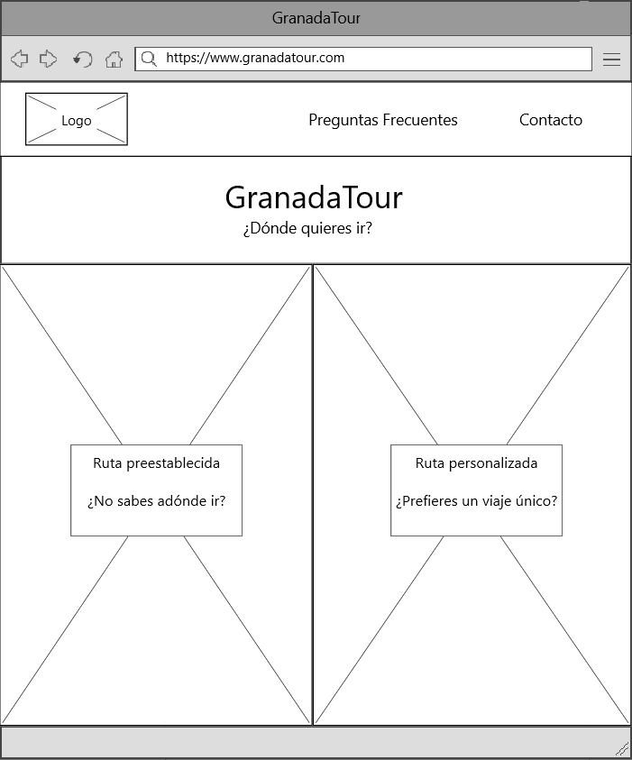
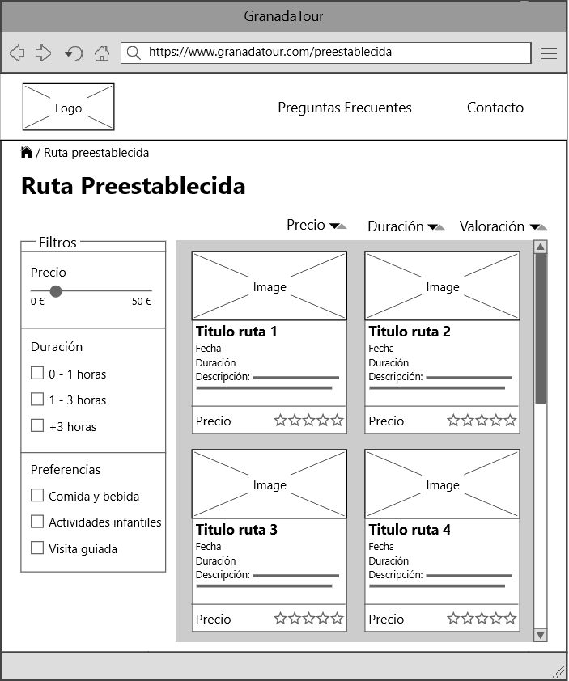
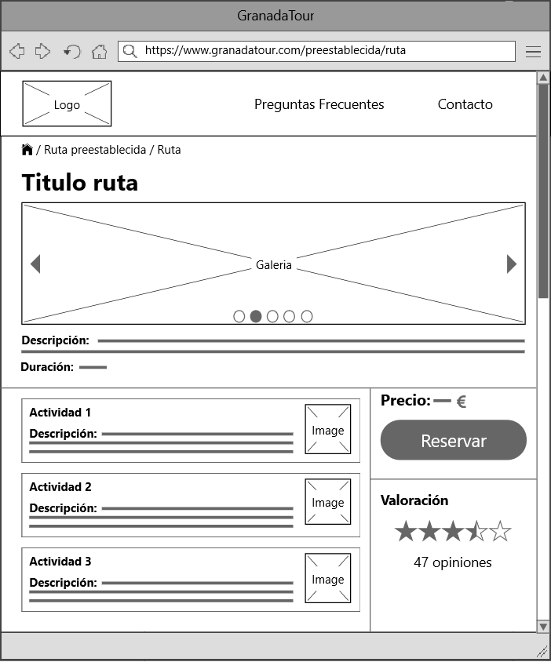
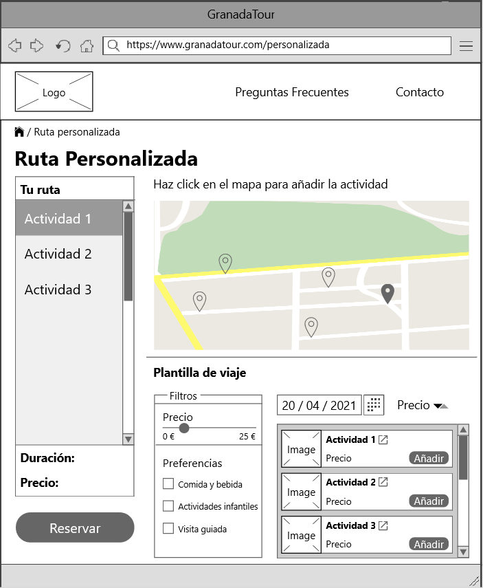
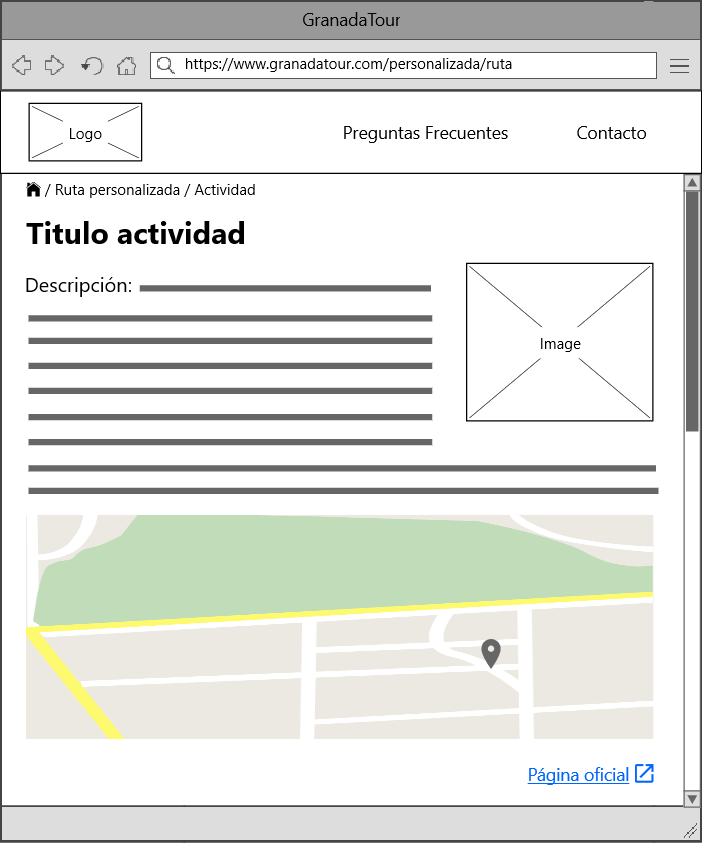
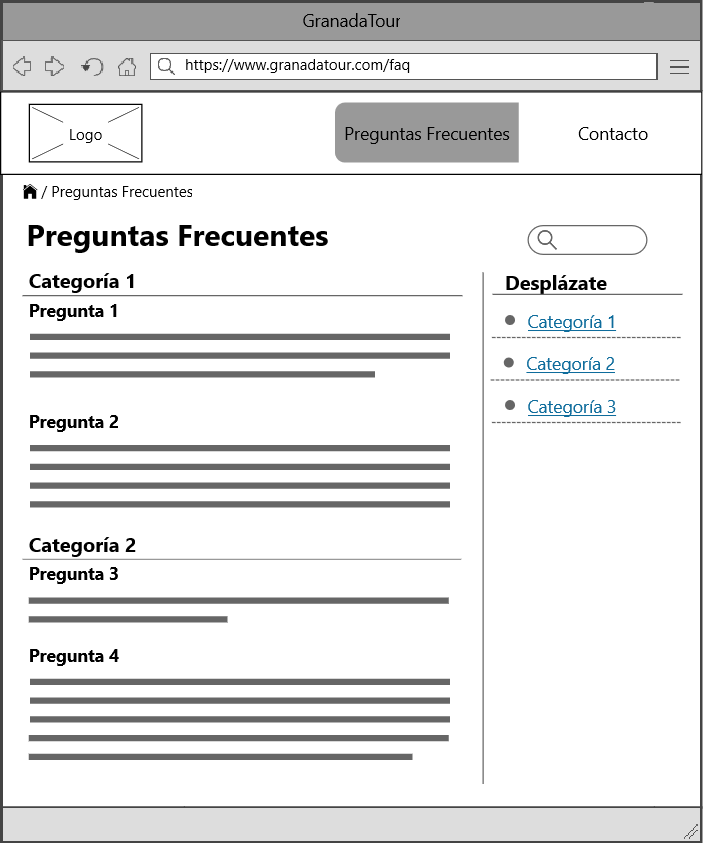
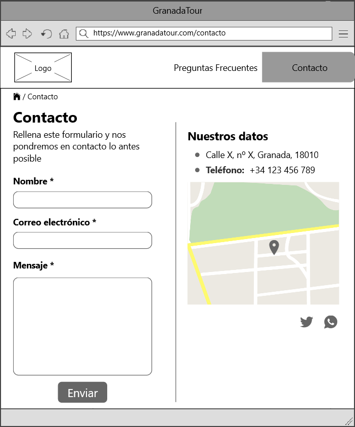

## Paso 2. UX Design

2.a Feedback Capture Grid
-----

2.b ScopeCanvas
-----
Nuestro proyecto, llamado GranadaTour, consiste en una aplicación para realizar rutas de carácter cultural en la ciudad de Granada. La aplicación permite seleccionar una ruta ya preestablecida o crear una propia, seleccionando las actividades que se quieren realizar.

2.c Task Analysis
-----
| Grupos de usuarios             | Jóvenes | Adultos sin hijos | Adultos con hijos | Ancianos | Agentes de viaje |  
| :------:                       | :------:| :----------------:| :----------------:| :--------| :---------------:|
| Buscar actividades infantiles  |    L    |          L        |          H        |     M    |         H        |
| Utilizar rutas preestablecidas |    L    |          M        |          H        |     H    |         M        |
| Utilizar rutas personalizables |    H    |          M        |          L        |     L    |         M        |
| Accesibilidad                  |    L    |          L        |         M/H       |     H    |         M        |    
| Ofertas                        |    H    |          M        |         M/H       |     L    |         M        |
| Comida incluida                |    L    |          H        |          M        |     H    |         M        |

2.d IA: Sitemap + Labelling
-----

| Label                | Scope Note                                                                                                                                  | 
| :------:             | :------------------------------------------------------------------------------------------------------------------------------------------:| 
| Preguntas Frecuentes | Ayuda para el usuario con respuestas a preguntas que han surgido a otro usuario                                                             |
| Contacto             | Forma de contactar con el servicio de atención al cliente, con atención 24h o de 8:00 a 18:00 con un agente                                 |
| Ruta preestablecida  | Acceso directo al sitio web de rutas preestablecidas                                                                                        |
| Ruta personalizada   | Acceso directo al sitio web de rutas personalizadas                                                                                         |
| Reservar             | Acceso al resumen de la ruta preestablecida o a la descripción lugar de una ruta personalizada y a opción de pago para obtener las entradas |
| Añadir               | Permite añadir un lugar/evento a una lista de lugares para formar una ruta personalizada                                                    |
| Página oficial       | Acceso directo a la página oficial a un lugar de alguna ruta                                                                                |

2.e Wireframes
-----

1. Index

Página principal de la aplicación. Permite a acceder a las páginas de seleccionar ruta / crear ruta, así como a las preguntas frecuentes y a la información de contacto.

2. Ruta preestablecida

Contiene cada una de las rutas disponibles. Permite la ordenación de las rutas según su precio, duración o valoración, además de un sistema de filtros. Al hacer click en una ruta, se accede a la página de información de dicha ruta.

3. Ruta

Contiene información de una ruta específica, así como una lista de todas las actividades que se van a realizar. Tiene una sección de valoración en el que se puede observar las valoraciones medias de los usuarios que han reservado la ruta, así como un botón para realizar la reserva.

4. Ruta personalizada

Permite la creación de rutas personalizadas mediante dos formas: la primera, se pueden añadir a la ruta seleccionando la actividad en un mapa interactivo. La segunda es a través de una plantilla de viaje, que ofrece un sistema de filtros y ordenación/selección de fecha. Al pulsar en el título de la actividad, se muestra la información de dicha actividad en otra página. La página calcula la duración y el precio total de todas las actividades seleccionadas.

5. Actividad

Contiene información de la actividad correspondiente y un mapa que muestra su localización. Además, contiene un enlace a la página oficial de dicha actividad.

6. Preguntas frecuentes

Esta página muestra información relativa al funcionamiento de la aplicación para los usuarios.

7. Contacto

Ofrece un formulario para ponerse en contacto con los desarrolladores de la aplicación así como otra información relevante.
