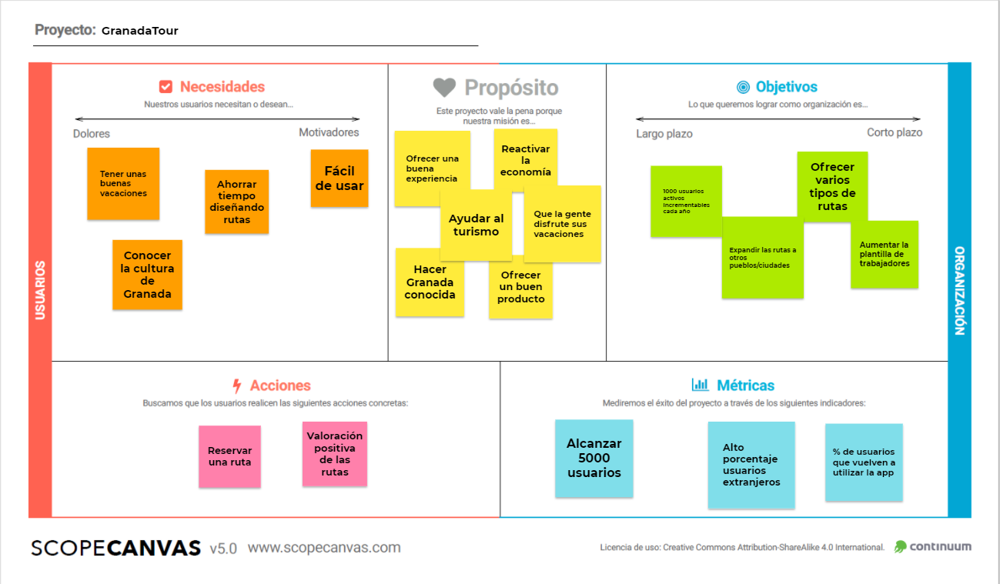

## Paso 2. UX Design

2.a Feedback Capture Grid
-----

2.b ScopeCanvas
-----
Nuestro proyecto, llamado GranadaTour, consiste en una aplicación para realizar rutas de carácter cultural en la ciudad de Granada. La aplicación permite seleccionar una ruta ya preestablecida o crear una propia, seleccionando las actividades que se quieren realizar.

2.c Task Analysis
-----
| Grupos de usuarios             | Jóvenes | Adultos sin hijos | Adultos con hijos | Ancianos | Agentes de viaje |  
| :------:                       | :------:| :----------------:| :----------------:| :--------| :---------------:|
| Buscar actividades infantiles  |    L    |          L        |          H        |     M    |         H        |
| Utilizar rutas preestablecidas |    L    |          M        |          H        |     H    |         M        |
| Utilizar rutas personalizables |    H    |          M        |          L        |     L    |         M        |
| Accesibilidad                  |    L    |          L        |         M/H       |     H    |         M        |    
| Ofertas                        |    H    |          M        |         M/H       |     L    |         M        |
| Comida incluida                |    L    |          H        |          M        |     H    |         M        |

### ARQUITECTURA DE INFORMACIÓN

* Sitemap 
* Labelling 

### Prototipo Lo-FI Wireframe 

### Conclusiones  
(incluye valoración de esta etapa)
