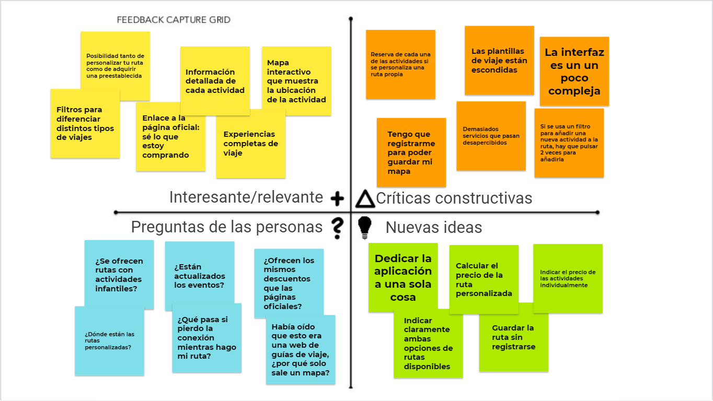

## Paso 2. UX Design

2.a Feedback Capture Grid
-----

2.b ScopeCanvas
-----
Nuestro proyecto, llamado GranadaTour, consiste en una aplicación para realizar rutas de carácter cultural en la ciudad de Granada. La aplicación permite seleccionar una ruta ya preestablecida o crear una propia, seleccionando las actividades que se quieren realizar.

### TASK ANALYSIS

* User Task Matrix 
* User/Task flow

### ARQUITECTURA DE INFORMACIÓN

* Sitemap 
* Labelling 

### Prototipo Lo-FI Wireframe 

### Conclusiones  
(incluye valoración de esta etapa)
