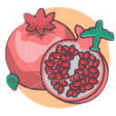
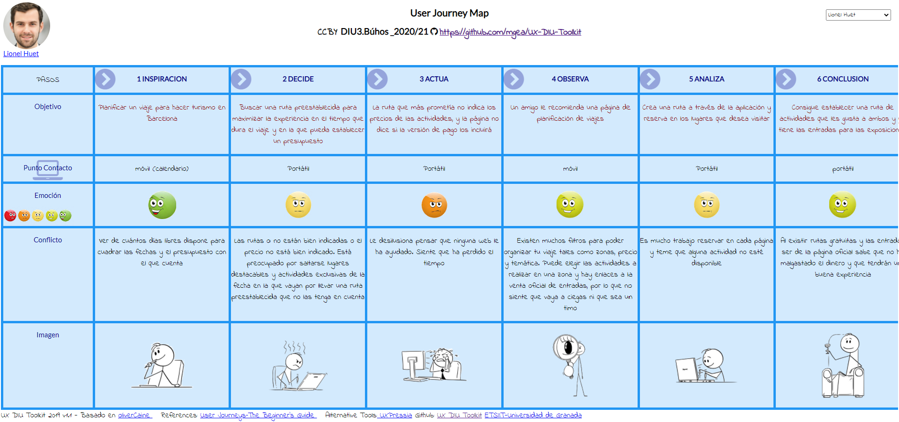
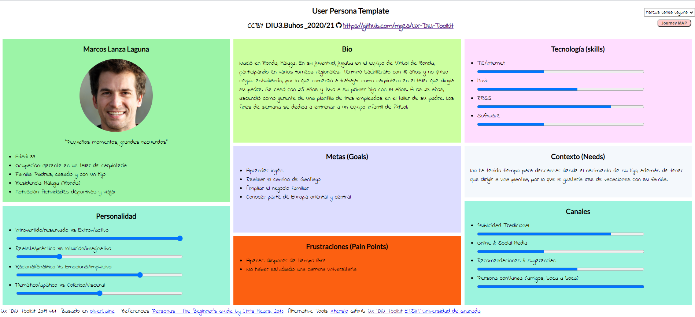
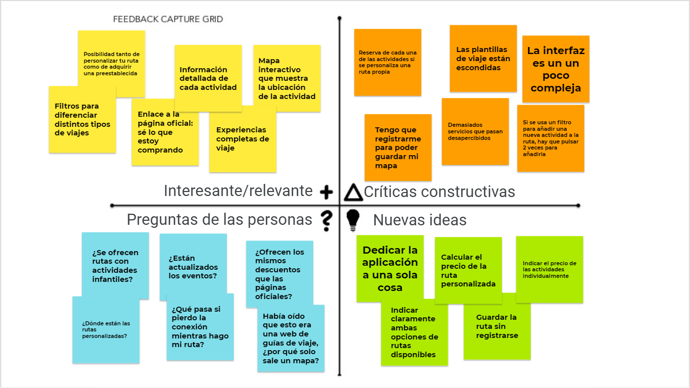
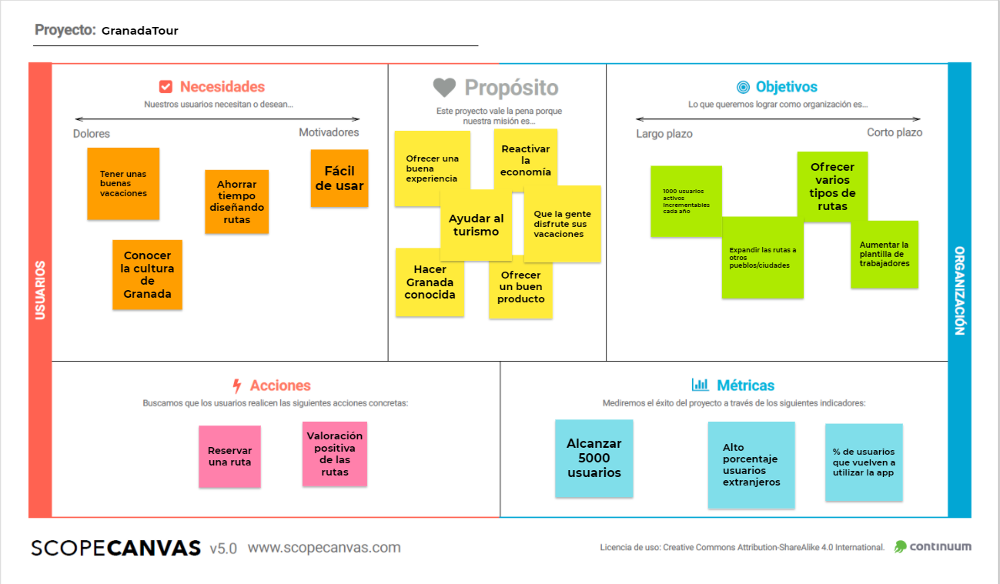
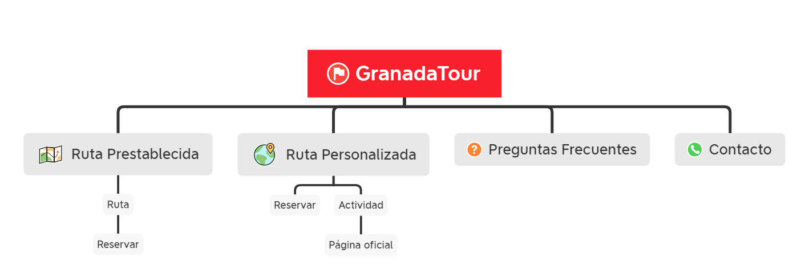

# DIU21
Prácticas Diseño Interfaces de Usuario 2020-21 (Tema: Turismo) 

Grupo: DIU3_BÚHOS.  Curso: 2020/21 
Updated: 28/04/2021

Proyecto: 

> GranadaTour

Descripción: 

> GranadaTour es una aplicación para realizar rutas de carácter cultural recorriendo la ciudad de Granada. La aplicación permite seleccionar una ruta ya preestablecida o crear una propia, seleccionando las actividades que se quieren realizar.

Logotipo: 

Miembros
 * :bust_in_silhouette:  Álvaro Domínguez Aguilar     :octocat:     
 * :bust_in_silhouette:  Laura Ortiz González     :octocat:

----- 

# Proceso de Diseño 

## Paso 1. UX Desk Research & Analisis 

 1.a Competitive Analysis
-----

Hemos analizado las webs de turismo: Freetour, way away, World Travel Guide, wanderlog, TripRepublic y Sygic. Hemos elegido Sygic como plataforma para analizar en profundidad, ya que esta cuenta tanto con tours prediseñados y fáciles de reservar como con la posibilidad de personalizar unas rutas ya sugeridas o crearlas desde cero; cubriendo así con lo que la mayoría de personas buscan en una página de planificación de viajes.

 1.b Persona
-----

- Lionel Huet

- Marcos Lanza Laguna
 

 1.c User Journey Map
----

- Lionel Huet

- Marcos Lanza Laguna

 1.d Usability Review
----
- Enlace al documento:
      Para ver el PDF [pulse aquí](P1/Usability_review.pdf)

- Valoración final: 75
- Comentario sobre la valoración: La página web ha obtenido una calificación de 75 puntos en la revisión de usabilidad, lo que puede considerarse como buena. Entre lo más destacable, incluye un amplio número de filtros que permiten seleccionar todo tipo de actividades y cada actividad va acompañada con información relevante (imágenes, descripción y ubicación en un mapa interactivo). Sin embargo, uno de sus mayores defectos es que es complicada de utilizar si no se tiene experiencia en este tipo de páginas web o conocimientos tecnológicos suficientes, debido a que la interfaz puede resultar confusa para el usuario, además de la dificultad que supone crear una ruta personalizada así como la reserva independiente de cada una de las actividades.

## Paso 2. UX Design  

 2.a Feedback Capture Grid / EMpathy map / POV
----

En la malla receptora de información hemos recabado toda la información de los usuarios de la práctica 1 (Lionel y Marcos). En esta malla receptora de información se ha tenido en cuenta las inquietudes/críticas de los usuarios así como las funcionalidades que satisfacían las necesidades y las mejoras que se podría realizar sobre la aplicación.

 2.b ScopeCanvas
----

 2.b Tasks analysis 
-----

| Grupos de usuarios             | Jóvenes | Adultos sin hijos | Adultos con hijos | Ancianos | Agentes de viaje |  
| :------:                       | :------:| :----------------:| :----------------:| :--------| :---------------:|
| Buscar actividades infantiles  |    L    |          L        |          H        |     M    |         H        |
| Utilizar rutas preestablecidas |    L    |          M        |          H        |     H    |         M        |
| Utilizar rutas personalizables |    H    |          M        |          L        |     L    |         M        |
| Accesibilidad                  |    L    |          L        |         M/H       |     H    |         M        |    
| Ofertas                        |    H    |          M        |         M/H       |     L    |         M        |
| Comida incluida                |    L    |          H        |          M        |     H    |         M        |

En la matriz de tareas/usuarios hemos enumerado los distintos perfiles de usuarios que pueden utilizar la aplicación y las frecuencias con que utilizarían las distintas funcionalidades de dicha aplicación.

 2.c IA: Sitemap + Labelling 
----

- Mapa del sitio

- Labelling

| Label                | Scope Note                                                                                                                                  | 
| :------:             | :------------------------------------------------------------------------------------------------------------------------------------------:| 
| Preguntas Frecuentes | Ayuda para el usuario con respuestas a preguntas que han surgido a otro usuario                                                             |
| Contacto             | Forma de contactar con el servicio de atención al cliente, con atención 24h o de 8:00 a 18:00 con un agente                                 |
| Ruta preestablecida  | Acceso directo al sitio web de rutas preestablecidas                                                                                        |
| Ruta personalizada   | Acceso directo al sitio web de rutas personalizadas                                                                                         |
| Reservar             | Acceso al resumen de la ruta preestablecida o a la descripción lugar de una ruta personalizada y a opción de pago para obtener las entradas |
| Añadir               | Permite añadir un lugar/evento a una lista de lugares para formar una ruta personalizada                                                    |
| Página oficial       | Acceso directo a la página oficial a un lugar de alguna ruta      

 2.d Wireframes
-----

Para ver los bocetos [pulse aquí](P2/Bocetos/)

## Paso 3. Mi UX-Case Study (diseño)

 3.a Moodboard
-----

>>> Plantear Diseño visual con una guía de estilos visual (moodboard) 
>>> Incluir Logotipo
>>> Si diseña un logotipo, explique la herramienta utilizada y la resolución empleada. ¿Puede usar esta imagen como cabecera de Twitter, por ejemplo, o necesita otra?

  3.b Landing Page
----

>>> Plantear Landing Page 

 3.c Guidelines
----

>>> Estudio de Guidelines y Patrones IU a usar 
>>> Tras documentarse, muestre las deciones tomadas sobre Patrones IU a usar para la fase siguiente de prototipado. 

  3.d Mockup
----

>>> Layout: Mockup / prototipo HTML  (que permita simular tareas con estilo de IU seleccionado)

 3.e ¿My UX-Case Study?
-----

>>> Publicar my Case Study en Github..
>>> Documente y resuma el diseño de su producto en forma de video de 90 segundos aprox

## Paso 4. Evaluación 

 4.a Caso asignado
----

>>> Breve descripción del caso asignado con enlace a  su repositorio Github

 4.b User Testing
----

>>> Seleccione 4 personas ficticias. Exprese las ideas de posibles situaciones conflictivas de esa persona en las propuestas evaluadas. Asigne dos a Caso A y 2 al caso B
 

| Usuarios | Sexo/Edad     | Ocupación   |  Exp.TIC    | Personalidad | Plataforma | TestA/B
| ------------- | -------- | ----------- | ----------- | -----------  | ---------- | ----
| User1's name  | H / 18   | Estudiante  | Media       | Introvertido | Web.       | A 
| User2's name  | H / 18   | Estudiante  | Media       | Timido       | Web        | A 
| User3's name  | M / 35   | Abogado     | Baja        | Emocional    | móvil      | B 
| User4's name  | H / 18   | Estudiante  | Media       | Racional     | Web        | B 

. 4.c Cuestionario SUS
----

>>> Usaremos el **Cuestionario SUS** para valorar la satisfacción de cada usuario con el diseño (A/B) realizado. Para ello usamos la [hoja de cálculo](https://github.com/mgea/DIU19/blob/master/Cuestionario%20SUS%20DIU.xlsx) para calcular resultados sigiendo las pautas para usar la escala SUS e interpretar los resultados
http://usabilitygeek.com/how-to-use-the-system-usability-scale-sus-to-evaluate-the-usability-of-your-website/)
Para más información, consultar aquí sobre la [metodología SUS](https://cui.unige.ch/isi/icle-wiki/_media/ipm:test-suschapt.pdf)

>>> Adjuntar captura de imagen con los resultados + Valoración personal 

 4.d Usability Report
----

>> Añadir report de usabilidad para práctica B (la de los compañeros)

>>> Valoración personal 

## Paso 5. Evaluación de Accesibilidad  

  5.a Accesibility evaluation Report 
----

>>> Indica qué pretendes evaluar (de accesibilidad) sobre qué APP y qué resultados has obtenido 

>>> 5.a) Evaluación de la Accesibilidad (con simuladores o verificación de WACG) 
>>> 5.b) Uso de simuladores de accesibilidad 

>>> (uso de tabla de datos, indicar herramientas usadas) 

>>> 5.c Breve resumen del estudio de accesibilidad (de práctica 1) y puntos fuertes y de mejora de los criterios de accesibilidad de tu diseño propuesto en Práctica 4.

## Conclusión final / Valoración de las prácticas

>>> (90-150 palabras) Opinión del proceso de desarrollo de diseño siguiendo metodología UX y valoración (positiva /negativa) de los resultados obtenidos  

