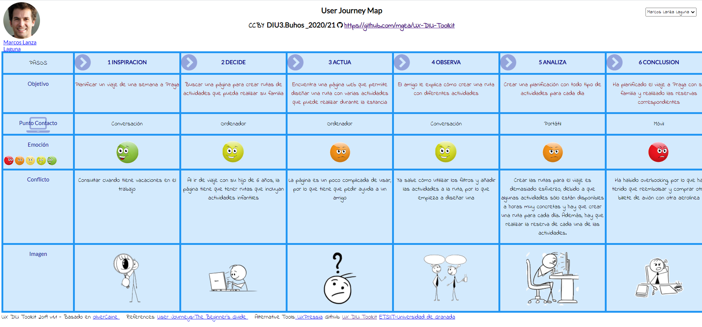

# DIU21
Prácticas Diseño Interfaces de Usuario 2020-21 (Tema: Turismo) 

Grupo: DIU3_BÚHOS.  Curso: 2020/21 
Updated: 28/04/2021

Proyecto: 

> GranadaTour

Descripción: 

> GranadaTour es una aplicación para realizar rutas de carácter cultural recorriendo la ciudad de Granada. La aplicación permite seleccionar una ruta ya preestablecida o crear una propia, seleccionando las actividades que se quieren realizar.

Logotipo: 

Miembros
 * :bust_in_silhouette:  Álvaro Domínguez Aguilar     :octocat:     
 * :bust_in_silhouette:  Laura Ortiz González     :octocat:

----- 

# Proceso de Diseño 

## Paso 1. UX Desk Research & Analisis 

 1.a Competitive Analysis
-----

Hemos analizado las webs de turismo: [Freetour](https://www.freetour.com), [way away](https://www.way-away.es/), [World Travel Guide](https://www.worldtravelguide.net/), [wanderlog](https://www.worldtravelguide.net/), [TripRepublic](https://triprepublic.com/) y [Sygic](https://travel.sygic.com/es). Hemos elegido Sygic como plataforma para analizar en profundidad, ya que esta cuenta tanto con tours prediseñados y fáciles de reservar como con la posibilidad de personalizar unas rutas ya sugeridas o crearlas desde cero; cubriendo así con lo que la mayoría de personas buscan en una página de planificación de viajes.

Para consultar la tabla de comparativas, pulse [aquí](P1/).

 1.b Persona
-----

Hemos creado dos personas ficticias que podrían ser usuarios potenciales de [Sygic](https://travel.sygic.com/es). El primero de ellos es Lionel, un joven al que le gustaría disfrutar de unas vacaciones.

El segundo es Marcos, un hombre sin muchos conocimientos tecnológicos que desearía ir de viaje con su familia al centro de Europa.
 

 1.c User Journey Map
----

En los mapas de experiencia de ambos usuarios, se expone la experiencia que han tenido Lionel y Marcos para realizar la reserva del viaje y los problemas que han surgido durante este proceso, como la dificultad de tener que reservar cada una de las actividades por separado y una interfaz no muy amigable para los usuarios que no han utilizado este tipo de páginas web.

- Lionel Huet

- Marcos Lanza Laguna

 1.d Usability Review
----
- Enlace al documento:
      Para ver el PDF [pulse aquí](P1/Usability_review.pdf)

- Valoración final: 75
- Comentario sobre la valoración: La página web ha obtenido una calificación de 75 puntos en la revisión de usabilidad, lo que puede considerarse como buena. Entre lo más destacable, incluye un amplio número de filtros que permiten seleccionar todo tipo de actividades y cada actividad va acompañada con información relevante (imágenes, descripción y ubicación en un mapa interactivo). Sin embargo, uno de sus mayores defectos es que es complicada de utilizar si no se tiene experiencia en este tipo de páginas web o conocimientos tecnológicos suficientes, debido a que la interfaz puede resultar confusa para el usuario, además de la dificultad que supone crear una ruta personalizada así como la reserva independiente de cada una de las actividades.

## Paso 2. UX Design  

 2.a Feedback Capture Grid / EMpathy map / POV
----

En la malla receptora de información hemos recabado toda la información de los usuarios de la práctica 1 (Lionel y Marcos). En esta malla receptora de información se ha tenido en cuenta las inquietudes/críticas de los usuarios así como las funcionalidades que satisfacían las necesidades y las mejoras que se podría realizar sobre la aplicación.

 2.b ScopeCanvas
----

Nuestro proyecto, llamado GranadaTour, consiste en una aplicación para realizar rutas de carácter cultural en la ciudad de Granada. La aplicación permite seleccionar una ruta ya preestablecida o crear una propia, seleccionando las actividades que se quieren realizar.

 2.b Tasks analysis 
-----

| Grupos de usuarios             | Jóvenes | Adultos sin hijos | Adultos con hijos | Ancianos | Agentes de viaje |  
| :------:                       | :------:| :----------------:| :----------------:| :--------| :---------------:|
| Buscar actividades infantiles  |    L    |          L        |          H        |     M    |         H        |
| Utilizar rutas preestablecidas |    L    |          M        |          H        |     H    |         M        |
| Utilizar rutas personalizables |    H    |          M        |          L        |     L    |         M        |
| Accesibilidad                  |    L    |          L        |         M/H       |     H    |         M        |    
| Ofertas                        |    H    |          M        |         M/H       |     L    |         M        |
| Comida incluida                |    L    |          H        |          M        |     H    |         M        |

En la matriz de tareas/usuarios hemos enumerado los distintos perfiles de usuarios que pueden utilizar la página web y las frecuencias con que utilizarían las distintas funcionalidades de dicha web.

 2.c IA: Sitemap + Labelling 
----
En el mapa del sitio se presentan todos los elementos que permiten la navegación por las diferentes secciones de la página web, así como una pequeña descripción de cada uno de esos elementos.

- Mapa del sitio

- Labelling

| Label                | Scope Note                                                                                                                                  | 
| :------:             | :------------------------------------------------------------------------------------------------------------------------------------------:| 
| Preguntas Frecuentes | Ayuda para el usuario con respuestas a preguntas que han surgido a otro usuario                                                             |
| Contacto             | Forma de contactar con el servicio de atención al cliente, con atención 24h o de 8:00 a 18:00 con un agente                                 |
| Ruta preestablecida  | Acceso directo al sitio web de rutas preestablecidas                                                                                        |
| Ruta personalizada   | Acceso directo al sitio web de rutas personalizadas                                                                                         |
| Reservar             | Acceso al resumen de la ruta preestablecida o a la descripción lugar de una ruta personalizada y a opción de pago para obtener las entradas |
| Añadir               | Permite añadir un lugar/evento a una lista de lugares para formar una ruta personalizada                                                    |
| Página oficial       | Acceso directo a la página oficial a un lugar de alguna ruta      

 2.d Wireframes
-----

Los wireframes se han diseñado teniendo en cuenta el principal enfoque de nuestro proyecto, permitir la selección de tours predefinidos o crear una ruta propia. En la sección de rutas predefinidas, se obtiene un listado de todos los tours disponibles así como una selección de filtros. Cada uno de estos tours lleva a una página con la descripción general del tour y las actividades en las que se compone así como la opción de reservar dicho tour.

En la sección de rutas personalizable, se dispone un listado de todas las actividades que se pueden añadir a la ruta y un mapa interactivo en el que se puede observar la localización de dicha actividad e información detallada.

Por último, se han diseñado secciones de preguntas frecuentes y contacto para los usuarios que lo necesiten.

Para ver los bocetos [pulse aquí](P2/Bocetos/)

## Paso 3. Mi UX-Case Study (diseño)

 3.a Moodboard
-----

El moodboard se puede observar en el siguiente [enlace](https://app.milanote.com/1Lzdo81SfLJFe1?p=R101J9FhGuJ).

Para el tipo de fuente, buscamos primero una que resaltara con el título así que nos decantamos por Anton; una Sans-Serif utilizada en publicidad. Su forma, aunque llamativa, no es excesivamente atrevida y da una sensación moderna, agradable y fácil de leer en una pantalla. Junto a esta, para complementar, elegimos una Montserrat ya que queríamos darle un toque de actualidad a nuestra página, salir de lo tradicional que es lo que se suele asociar al turismo en Granada.

Para los colores, quisimos mantener la esencia de Granada, el rojo y amarillo que recuerdan a la propia fruta y aportan una sensación de calidez en la página. Asimismo, para contrastar y dar vida a la página utilizamos un verde como color de resalte. Para mantener esa calidez utilizamos versiones pastel de los colores. Además, para favorecer la lectura de la página y la accesibilidad de la misma, utilizamos letra negra sobre fondo blanco.

-  `#f999a2` Como color principal. El texto será blanco sobre este color.
-  `#ffc99d` Como color secundario. El texto será negro sobre este color.
-  `#77c1ad` Como color de resalte para iconos y botones. El texto será blanco sobre este 

  3.b Landing Page
----

 3.c Guidelines
----

Utilizaremos los siguientes patrones:
- Para el rellenado de formularios (en la sección de preguntas o de contacto), se utilizarán diversos patrones:
    - El propio **Contact Forms**, para permitir al usuario contactar con nosotros.
    - **Input Hints**, para ayudar al usuario a saber qué debe escribir en cada cuadro.
    - **Inline Validation**, por si algún cuadro obligatorio no está rellenado o hay información errónea.
     
- Para reservar utilizaremos los siguientes patrones:
    - **Immediate Immersion** (Lazy Signups). Para favorecer la estancia del usuario en la web y disminuir su nivel de malestar, no forzaremos a iniciar sesión hasta que se tenga que reservar un viaje o se quiera guardar la ruta de viaje que se esté construyendo.
    - **Social Login**. Permitiremos iniciar sesión con redes sociales además del correo electrónico, para favorecer la fluidez y comodidad del usuario.
    - **Stepped Form** (Wizards), para orientar al usuario en las diversas etapas de la reserva del viaje.
    - **Morphing Controls**. El botón de añadir y quitar actividad no pueden aparecer a la vez.
    - **Undo**. Para ayudar al usuario si este se equivoca.
    
- Para el Onboarding utilizaremos los siguientes patrones:
    - **Walkthroughs**
    - **Next Steps**
    - **Calls to Action**
    - **Modals**

  3.d Mockup
----

En los prototipos se han mejorado los defectos detectados tras la realización  de los wireframes (nombre de las secciones, colocación de los elementos dentro de la página web, etc.). Además, se ha hecho uso de los colores y fuentes de texto previamente seleccionadas, así como de los distintos patrones de diseño para la realización del prototipo de nuestra página web.

Para ver los prototipos, pulse [aquí](P3/).

 3.e ¿My UX-Case Study?
-----

Mediante la realización de este proyecto, 

## Paso 4. Evaluación 

 4.a Caso asignado
----

>>> Breve descripción del caso asignado con enlace a  su repositorio Github

 4.b User Testing
----

>>> Seleccione 4 personas ficticias. Exprese las ideas de posibles situaciones conflictivas de esa persona en las propuestas evaluadas. Asigne dos a Caso A y 2 al caso B
 

| Usuarios | Sexo/Edad     | Ocupación   |  Exp.TIC    | Personalidad | Plataforma | TestA/B
| ------------- | -------- | ----------- | ----------- | -----------  | ---------- | ----
| User1's name  | H / 18   | Estudiante  | Media       | Introvertido | Web.       | A 
| User2's name  | H / 18   | Estudiante  | Media       | Timido       | Web        | A 
| User3's name  | M / 35   | Abogado     | Baja        | Emocional    | móvil      | B 
| User4's name  | H / 18   | Estudiante  | Media       | Racional     | Web        | B 

. 4.c Cuestionario SUS
----

>>> Usaremos el **Cuestionario SUS** para valorar la satisfacción de cada usuario con el diseño (A/B) realizado. Para ello usamos la [hoja de cálculo](https://github.com/mgea/DIU19/blob/master/Cuestionario%20SUS%20DIU.xlsx) para calcular resultados sigiendo las pautas para usar la escala SUS e interpretar los resultados
http://usabilitygeek.com/how-to-use-the-system-usability-scale-sus-to-evaluate-the-usability-of-your-website/)
Para más información, consultar aquí sobre la [metodología SUS](https://cui.unige.ch/isi/icle-wiki/_media/ipm:test-suschapt.pdf)

>>> Adjuntar captura de imagen con los resultados + Valoración personal 

 4.d Usability Report
----

>> Añadir report de usabilidad para práctica B (la de los compañeros)

>>> Valoración personal 

## Paso 5. Evaluación de Accesibilidad  

  5.a Accesibility evaluation Report 
----

>>> Indica qué pretendes evaluar (de accesibilidad) sobre qué APP y qué resultados has obtenido 

>>> 5.a) Evaluación de la Accesibilidad (con simuladores o verificación de WACG) 
>>> 5.b) Uso de simuladores de accesibilidad 

>>> (uso de tabla de datos, indicar herramientas usadas) 

>>> 5.c Breve resumen del estudio de accesibilidad (de práctica 1) y puntos fuertes y de mejora de los criterios de accesibilidad de tu diseño propuesto en Práctica 4.

## Conclusión final / Valoración de las prácticas

>>> (90-150 palabras) Opinión del proceso de desarrollo de diseño siguiendo metodología UX y valoración (positiva /negativa) de los resultados obtenidos  

